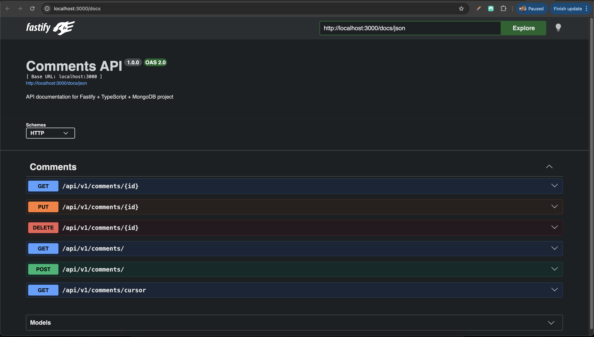

# Fastify + TypeScript + MongoDB API

A high-performance REST API built with **Fastify**, **TypeScript**, and **MongoDB**.  
This project uses a **plugin-based architecture**, schema validation, modular routes, and Swagger documentation.

---

## 📦 Features

- Fastify with **TypeScript** support
- MongoDB connection via **plugin**
- Modular route structure
- JSON schema validation for requests
- CORS enabled
- Environment variable configuration (`.env`)
- **Swagger / OpenAPI documentation** at `/docs`

---

## 🛠️ Prerequisites

- Node.js >= 18
- npm >= 8
- MongoDB running locally or on a cloud service

---

## ⚡ Installation

Clone the repository:

```bash
git clone <your-repo-url>
cd fastify-ts-mongo
npm install
```

Create a .env file in the root:

```bash
PORT=3000
MONGO_URI=mongodb://localhost:27017/comment-db
```

🚀 Running the Server

```bash
npm run dev
```

Server will start at: http://localhost:3000
Swagger documentation: http://localhost:3000/docs

## 📸 Preview

<div align="center">
    <div style="display: grid; grid-template-columns: repeat(3, 1fr); gap: 20px; margin: 20px 0;">
        <div>
            
        </div>
    </div>
</div>
